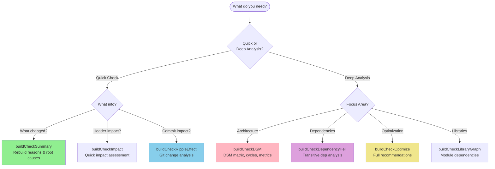
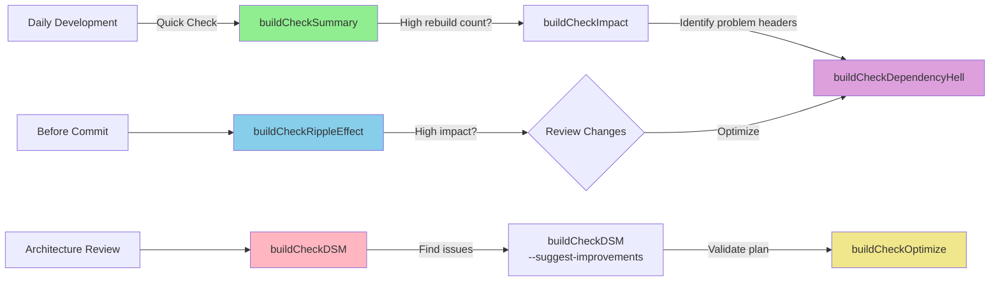

# BuildCheck Tools

> **⚠️ EXPERIMENTAL PROJECT**  
> This is an experimental research project created with extensive AI assistance (Claude/GitHub Copilot).  
> While the tools have comprehensive test coverage (749+ tests) and demonstrate useful capabilities,  
> they should be considered experimental and used with appropriate caution in production environments.

[](https://opensource.org/licenses/BSD-3-Clause)
[](https://www.python.org/downloads/)

A comprehensive suite of tools for analyzing C/C++ build dependencies, identifying rebuild bottlenecks, and optimizing compilation times in large projects using Ninja build system.

## 🎯 What Does BuildCheck Do?

BuildCheck helps you answer critical questions about your C/C++ build:

- 💡 **"What will rebuild if I change this header?"** → See exact impact before committing
- 🔍 **"Why is my build so slow?"** → Identify dependency bottlenecks and high-cost headers
- 🏗️ **"Is my architecture healthy?"** → Detect cycles, god objects, and coupling issues
- 🚀 **"How can I optimize build times?"** → Get actionable refactoring recommendations with ROI estimates
- 📊 **"What changed and why is it rebuilding?"** → Understand rebuild reasons and root causes

## 🔧 Core Tools Overview

BuildCheck provides 9 specialized tools that work together to give you complete visibility into your build system:

| Tool | Purpose | When to Use |
|------|---------|-------------|
| **[buildCheckSummary](#buildchecksummary)** | What's rebuilding and why | Daily development, quick rebuild analysis |
| **[buildCheckDSM](#buildcheckdsm)** | Architecture quality & DSM analysis | Architecture reviews, proactive refactoring |
| **[buildCheckRippleEffect](#buildcheckrippleeffect)** | Git commit impact estimation | Before committing, CI/CD planning |
| **[buildCheckDependencyHell](#buildcheckdependencyhell)** | Transitive dependency analysis | Find expensive headers to refactor |
| **[buildCheckOptimize](#buildcheckoptimize)** | Comprehensive optimization recommendations | Planning major refactoring efforts |
| **buildCheckImpact** | Quick header impact assessment | Fast impact checks without full analysis |
| **buildCheckIncludeGraph** | Include graph with clang-scan-deps | Accurate gateway header analysis |
| **buildCheckIncludeChains** | Co-occurrence pattern analysis | Understanding indirect coupling |
| **buildCheckLibraryGraph** | Library-level dependency visualization | Module architecture validation |

## 🗺️ Tool Selection Guide



## 🔄 Typical Workflow



## 📦 Installation

### Prerequisites

- **Python 3.7+** (required)
- **Ninja build system** (required) - `sudo apt install ninja-build` or `brew install ninja`
- **Clang 18 or 19** (required for tools using clang-scan-deps)
  ```bash
  # Ubuntu/Debian
  sudo apt install clang-19
  
  # macOS
  brew install llvm
  ```

### Install BuildCheck

```bash
# Clone the repository
git clone https://github.com/Unarmed1000/build-check.git
cd build-check

# Install Python dependencies
pip install -r requirements.txt

# Make scripts executable
chmod +x buildCheck*.py

# Optional: Enable bash completion (see BASH_COMPLETION.md for details)
source buildcheck-completion.bash
```

### Dependencies

```bash
# Core dependencies (required)
pip install networkx>=2.8.8 GitPython>=3.1.40 packaging>=24.0

# Statistical analysis (required for buildCheckDSM)
pip install numpy>=1.24.0 scipy>=1.14.1

# Terminal colors (optional but recommended)
pip install colorama>=0.4.6
```

## 🚀 Quick Start

### 1. Basic Rebuild Analysis

```bash
# See what will rebuild and why
./buildCheckSummary.py ../build/release/

# Get detailed file list
./buildCheckSummary.py ../build/release/ --detailed

# Export as JSON for CI/CD
./buildCheckSummary.py ../build/release/ --format json --output report.json
```

**Example Output:**
```
=== Rebuild Summary ===
Rebuilt files: 47

Reasons:
   35  → input source changed
   12  → output missing

Root Causes:
  include/core/Types.hpp → triggered 18 rebuilds
  include/utils/Logger.hpp → triggered 12 rebuilds
```

### 2. Architecture Quality Check

```bash
# Analyze architecture with DSM matrix
./buildCheckDSM.py ../build/release/

# Get proactive improvement suggestions
./buildCheckDSM.py ../build/release/ --suggest-improvements

# Focus on circular dependencies
./buildCheckDSM.py ../build/release/ --cycles-only
```

**Example Output:**
```
=== Improvement Candidates (Ranked by ROI) ===

🔴 CRITICAL (ROI: 85.2)
  Header: include/core/GodObject.hpp
  Issues: God Object (fan-out: 45), Cycle Participant, Coupling Outlier
  Impact: Would reduce rebuild time by ~23% (156 → 120 files)
  Effort: Medium (2-3 weeks)
  Break-even: ~8 commits
```

### 3. Git Commit Impact Analysis

```bash
# Estimate impact of uncommitted changes
./buildCheckRippleEffect.py ../build/release/

# Analyze specific commit
./buildCheckRippleEffect.py ../build/release/ --commit abc123f

# Analyze commit range
./buildCheckRippleEffect.py ../build/release/ --commit HEAD~5..HEAD
```

**Example Output:**
```
=== Git Ripple Effect Analysis ===

Changed Headers (2):
  • include/core/Types.hpp → affects 156 source files
  • include/utils/Logger.hpp → affects 89 source files

Summary:
  Total affected sources: 245
  Rebuild percentage: 12.3% (245/2000)
  Impact: MODERATE (10-30% rebuild)
```

### 4. Find Dependency Bottlenecks

```bash
# Comprehensive transitive dependency analysis
./buildCheckDependencyHell.py ../build/release/

# Show top 20 problematic headers
./buildCheckDependencyHell.py ../build/release/ --top 20

# Focus on specific directory
./buildCheckDependencyHell.py ../build/release/ --filter "include/core/*"
```

### 5. Get Optimization Recommendations

```bash
# Full optimization analysis
./buildCheckOptimize.py ../build/release/

# Quick analysis (skip expensive operations)
./buildCheckOptimize.py ../build/release/ --quick

# Generate optimization report
./buildCheckOptimize.py ../build/release/ --report optimization_plan.txt
```

## 📚 Core Tools Deep Dive

### buildCheckSummary

**Purpose:** Quickly analyze what files would rebuild and identify root causes.

**Key Features:**
- Runs `ninja -n -d explain` to detect rebuild reasons
- Categorizes reasons (input changed, output missing, command line changed, etc.)
- Identifies root cause headers triggering cascading rebuilds
- Multiple output formats (text, JSON)
- No external dependencies beyond Ninja

**Use Cases:**
- Daily development: "What changed and why?"
- Pre-commit checks: "Is this rebuild reasonable?"
- CI/CD reporting: Export JSON for build dashboards

**Documentation:** [README_buildCheckSummary.md](README_buildCheckSummary.md)

---

### buildCheckDSM

**Purpose:** Comprehensive architecture analysis using Dependency Structure Matrix (DSM) methodology.

**Key Features:**
- **Matrix Visualization:** Visual DSM showing all header dependencies
- **Cycle Detection:** Identifies circular dependencies with minimum feedback set
- **Layered Architecture:** Computes dependency layers and validates architecture
- **Coupling Metrics:** Fan-in, fan-out, stability, PageRank centrality
- **Proactive Analysis:** `--suggest-improvements` recommends high-ROI refactorings
- **Differential Analysis:** Compare architectures across builds/commits
- **Statistical Analysis:** Coupling distribution, outlier detection (uses NumPy)

**Anti-Pattern Detection:**
- God Objects (high fan-out)
- Circular Dependencies
- Coupling Outliers (statistical analysis)
- Unstable Interfaces (low stability score)
- Hub Nodes (architectural bottlenecks)

**Header Classification by Architectural Role:**

BuildCheckDSM categorizes headers based on their fan-in/fan-out patterns to distinguish between healthy architectural patterns and problematic anti-patterns:

| Classification | Pattern | Indicators | Assessment | Example |
|---------------|---------|-----------|------------|---------|
| **Foundation Headers** | High fan-in<br/>Low fan-out | 30+ dependents<br/>< 10 dependencies<br/>Stability: 0.00-0.10 | ✅ **GOOD**<br/>Stable base, high reuse | `BasicTypes.hpp`<br/>`Vector2.hpp` |
| **God Objects** | High fan-out<br/>Low fan-in | 30+ dependencies<br/>< 10 dependents<br/>Stability: 0.90-1.00 | ❌ **BAD**<br/>Knows too much, needs splitting | `Manager.hpp` with many includes |
| **Middleman Headers** | High fan-in<br/>High fan-out | 15+ dependents<br/>15+ dependencies<br/>Stability: 0.40-0.60 | ⚠️ **PROBLEMATIC**<br/>Coupling bottleneck | `BaseWindow.hpp` acting as broker |
| **Leaf/Client Headers** | Low fan-in<br/>Low fan-out | < 15 dependents<br/>< 15 dependencies<br/>Stability: varies | ✓ **NEUTRAL**<br/>Isolated component | Application-specific files |

**Stability Score Interpretation:**
- **0.00-0.10** = Highly stable (foundation, rarely changes)
- **0.40-0.60** = Medium stability (middleman, coupling point)
- **0.90-1.00** = Highly unstable (god object, frequently changes)

**Note:** Foundation headers are listed in `--verbose` mode only, as they represent healthy architecture and don't require action.

**ROI Calculation:**
- Estimates rebuild time savings
- Calculates break-even point (commits until payback)
- Prioritizes by severity: 🟢 Quick Wins, 🔴 Critical, 🟡 Moderate

**Use Cases:**
- Architecture reviews and technical debt assessment
- Proactive refactoring planning with cost/benefit analysis
- Tracking architectural quality over time
- Validating layered architecture compliance

**Documentation:** [README_buildCheckDSM.md](README_buildCheckDSM.md)

---

### buildCheckRippleEffect

**Purpose:** Estimate rebuild impact of uncommitted changes or specific commits.

**Key Features:**
- Git integration: Analyzes working directory vs HEAD
- Supports specific commits, commit ranges, branches
- Uses clang-scan-deps for accurate dependency graph
- Calculates transitive impact for changed headers
- Impact severity classification (LOW/MODERATE/HIGH/CRITICAL)

**Use Cases:**
- Pre-commit validation: "How much will this rebuild?"
- Code review: Assess change scope and test coverage needed
- CI/CD planning: Estimate build time impact
- Refactoring validation: Verify changes reduced dependencies

**Documentation:** Built-in help: `./buildCheckRippleEffect.py --help`

---

### buildCheckDependencyHell

**Purpose:** Multi-dimensional analysis of transitive dependencies to find "expensive" headers.

**Key Features:**
- **Transitive Dependency Count:** How many headers does this pull in?
- **Build Impact:** Total compilation cost (deps × usage)
- **Rebuild Cost:** If changed, how many sources would rebuild?
- **Reverse Impact:** How many headers depend on this one?
- **Hub Detection:** Architectural bottlenecks
- **Maximum Chain Length:** Deepest include path through this header
- **Severity Classification:** CRITICAL/HIGH/MODERATE

**Metrics Provided:**
- Direct vs transitive dependencies
- Usage frequency across compilation units
- Base type identification (no project dependencies)
- Ranked lists by different impact dimensions

**Use Cases:**
- "Which header should I refactor first?"
- Identify architectural bottlenecks (hub headers)
- Prioritize technical debt reduction
- Validate refactoring effectiveness (re-run after changes)

**Documentation:** Built-in help: `./buildCheckDependencyHell.py --help`

---

### buildCheckOptimize

**Purpose:** Comprehensive optimization recommendations combining header-level and library-level analysis.

**Key Features:**
- Integrates insights from multiple analysis tools
- Prioritizes recommendations by impact
- Identifies header, library, and architectural bottlenecks
- Suggests specific refactoring actions
- Estimates effort and benefits

**Analysis Areas:**
- Header-level optimization (high-cost includes)
- Library-level optimization (module structure)
- Cycle elimination strategies
- Coupling reduction opportunities

**Use Cases:**
- Planning major refactoring efforts
- Creating technical debt roadmap
- Estimating optimization ROI
- Validating architecture decisions

**Documentation:** Built-in help: `./buildCheckOptimize.py --help`

## 📖 Additional Tools

### buildCheckImpact

Quick impact analysis using Ninja's dependency tracking. Fast baseline analysis without clang-scan-deps.

**Usage:**
```bash
./buildCheckImpact.py ../build/release/
./buildCheckImpact.py ../build/release/ --all-headers
```

### buildCheckIncludeGraph

Accurate include graph using clang-scan-deps. Identifies "gateway headers" that pull in excessive dependencies.

**Usage:**
```bash
./buildCheckIncludeGraph.py ../build/release/
./buildCheckIncludeGraph.py ../build/release/ --top-gateways 20
```

**Documentation:** Built-in help

### buildCheckIncludeChains

Analyzes co-occurrence patterns to understand indirect coupling and include chains.

**Usage:**
```bash
./buildCheckIncludeChains.py ../build/release/
```

**Documentation:** [README_buildCheckIncludeChains.md](README_buildCheckIncludeChains.md)

### buildCheckLibraryGraph

Library-level dependency analysis from build.ninja. Coarser-grained view focusing on module structure.

**Usage:**
```bash
./buildCheckLibraryGraph.py ../build/release/
./buildCheckLibraryGraph.py ../build/release/ --export library_graph.dot
```

**Documentation:** [README_buildCheckLibraryGraph.md](README_buildCheckLibraryGraph.md)

## 🧪 Testing

BuildCheck has comprehensive test coverage:

- **749+ unit and integration tests**
- **Coverage:** Core functionality, edge cases, security (path traversal, injection prevention)
- **Test categories:** Unit, integration, security, performance

Run tests:
```bash
cd test
./run_tests.sh

# Or with pytest directly
pytest -v

# With coverage report
pytest --cov=. --cov-report=html
```

See [TEST_SUITE_SUMMARY.md](TEST_SUITE_SUMMARY.md) for details.

## 🛠️ Troubleshooting

### ccache Compatibility

If using ccache and encountering errors like `error: no such file or directory: 'sloppiness=...'`:

BuildCheck automatically sanitizes ccache-related arguments from compile_commands.json. If issues persist:

1. Ensure you're using Clang 18+
2. Check that compile_commands.json is properly generated
3. See detailed troubleshooting in [README_buildCheckDSM.md](README_buildCheckDSM.md#troubleshooting)

### Large Projects

For very large codebases (>10,000 files):

- Use `--filter` to focus on specific directories
- Consider `--quick` mode in buildCheckOptimize
- Use `--top N` to limit output in various tools
- Run analysis on module subsets

### Performance Tips

- **Parallel Analysis:** Most tools using clang-scan-deps run in parallel (use all CPU cores)
- **Caching:** Results are cached where possible; delete `.buildcheck_cache/` to force refresh
- **Incremental Analysis:** Use differential mode (`--compare-with`) to analyze only changes

## 🤝 Contributing

Contributions are welcome! Please see [CONTRIBUTING.md](CONTRIBUTING.md) for:

- Development setup
- Coding standards
- Testing guidelines
- Pull request process

### Development Dependencies

```bash
pip install -r test/requirements-test.txt
```

This includes pytest, pytest-cov, pytest-mock, mypy, and black.

## 📝 Examples and Documentation

- **[EXAMPLES.md](EXAMPLES.md)** - Comprehensive usage examples and common workflows
- **[CHANGELOG.md](CHANGELOG.md)** - Version history and recent changes
- **[CONTRIBUTING.md](CONTRIBUTING.md)** - Contribution guidelines
- **Tool-specific READMEs** - Detailed documentation for each tool

## 📊 Project Structure

```
build-check/
├── buildCheck*.py          # Main tool scripts (9 tools)
├── lib/                    # Shared library modules
│   ├── clang_utils.py     # clang-scan-deps integration
│   ├── ninja_utils.py     # Ninja build system utilities
│   ├── git_utils.py       # Git integration
│   ├── graph_utils.py     # NetworkX graph analysis
│   ├── dsm_*.py          # DSM analysis modules
│   └── ...
├── test/                   # Comprehensive test suite (749+ tests)
├── demo/                   # Demo scripts and examples
├── README*.md             # Documentation
└── requirements.txt       # Python dependencies
```

## 🎓 Learn More

### Related Tools and Concepts

- **Ninja Build System:** https://ninja-build.org/
- **Clang Scan-deps:** https://clang.llvm.org/docs/ClangScanDeps.html
- **DSM Methodology:** Design Structure Matrix for architecture analysis
- **Build Performance:** https://www.incredibuild.com/blog/cpp-compilation-optimization

### Use Case Scenarios

1. **Daily Development:** Run `buildCheckSummary` after pulling changes to see rebuild impact
2. **Code Review:** Use `buildCheckRippleEffect` to assess PR scope and testing needs
3. **Sprint Planning:** Run `buildCheckDSM --suggest-improvements` to identify tech debt
4. **Architecture Review:** Generate DSM reports quarterly to track architectural quality
5. **CI/CD Optimization:** Use JSON outputs for dashboard integration and trend analysis

## ⌨️ Bash Completion

BuildCheck includes comprehensive bash completion for all tools, providing:

- Tab-completion for all command options
- Directory path completion for build directories
- File path completion for output files
- Smart completion for format choices and other enumerated options

**Quick Setup:**

```bash
# Enable for current session
source buildcheck-completion.bash

# Or add to ~/.bashrc for permanent use
echo "source $(pwd)/buildcheck-completion.bash" >> ~/.bashrc
```

**Usage Examples:**

```bash
buildCheckSummary --<Tab><Tab>     # Shows all options
buildCheckDSM ../build/<Tab>       # Completes directory paths
buildCheckSummary --format <Tab>   # Shows: text json
```

For detailed installation options and troubleshooting, see [BASH_COMPLETION.md](BASH_COMPLETION.md).

## 📄 License

This project is licensed under the **BSD 3-Clause License** - see the [LICENSE](LICENSE) file for details.

Copyright (c) 2025, Rene Thrane  
All rights reserved.

## 🙏 Acknowledgments

This project was created with extensive AI assistance (Claude/GitHub Copilot) as an experimental research project. While it demonstrates useful capabilities and has comprehensive test coverage, it should be used with appropriate caution in production environments.

## 📞 Support and Feedback

- **Issues:** [GitHub Issues](https://github.com/Unarmed1000/build-check/issues)
- **Repository:** [github.com/Unarmed1000/build-check](https://github.com/Unarmed1000/build-check)

---

**Happy Building! 🚀**

*BuildCheck - Because understanding your build shouldn't be harder than writing the code.*

